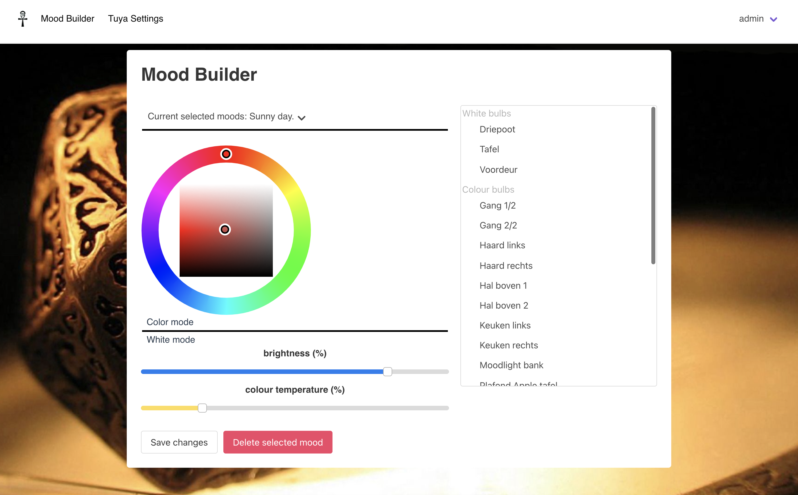
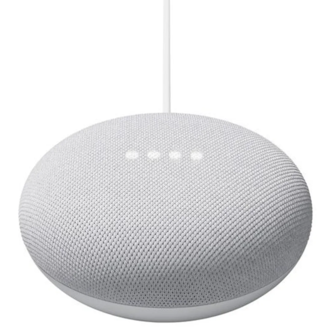

# LightBox 



#### Features:

- Auto discover tuya lights
- Set and create moods (aka: light profiles)
- Change moods via IFTTT
- List moods via IFTTT
- FuzzyWuzzy, speech correction
- Change multiple lights at once
- Light groups
- Rotate colors within light groups

#### Roadmap

- Philips Hue/Zigbee support

#### Why???

The tuya (and consortia) app sucks! Also, it's fun to code!

#### How to run the application

Make sure you have docker and docker-compose installed. Make up a password for your database e.g. g52nkIOn12@
Now head to the root of this project (where the docker-compose.yml file is) with your terminal and run:

```angular2html
MONGO_PASSWORD=g52nkIOn12@ docker-compose -f docker-compose.yml up -d --build --remove-orphans
```

The application will be build and executed. Building takes around 2 minutes. Then open http://your-docker-host:7890 in 
your browser. The default password for admin is admin. 

#### Configure your environment

- TuYa 

Create a tuya developer account and create a cloud app (https://developer.tuya.com/en/docs/iot/Configuration_Guide_custom?id=Kamcfx6g5uyot)
Open the tab 'Tuya Settings' and fill in the required fields and hit save changes. LightBox will automatically scan your
available light-bulbs and populate your database. Once this is done you can have fun in the Mood builder tab.

- IFTTT

For IFTTT to work, Lightbox needs to be reachable from the internet. Make sure you forward port 7890 on your router
to the docker host. Next, create an IFTTT (https://ifttt.com/) account and create two applets. One is for setting a mood 
and the other for getting all available moods, via the google assistent (eg. google mini)



```angular2html
Query the available moods:
    
IF (Google Assistant):
    Say a simple phrase (eg. 'list lightbox scenes')
THEN (Webhook)
    GET: http://external_ip:7890/api/tuya_get_mood_names

Set an available mood:

IF (Google Assistant):
    Say a phrase with a text ingredient (eg. 'activate scene $')
THEN (Webhook)
    POST: http://external_ip:7890/api/tuya_set_mood 
    BODY: {"name": "textfield"}
```

#### Default user
At first startup a default login user will be created
```
username: admin
password: admin
```
